# 🏗️ Architecture Diagrams

**Visual architecture documentation for the extraction project**

[Extraction Plan](./EXTRACTION_PLAN.md) • [Quick Reference](./QUICK_REFERENCE.md) • [File Map](./FILE_EXTRACTION_MAP.md) • [Summary](./EXTRACTION_SUMMARY.md)

---

## 📋 Table of Contents

- [System Overview](#-system-overview)
- [Package Architecture](#-package-architecture)
- [Data Flow Diagrams](#-data-flow-diagrams)
- [Team Parallelization](#-team-parallelization)
- [Phase 2: Ivy Integration](#-phase-2-ivy-integration)

---

## 🎯 System Overview

### High-Level Architecture

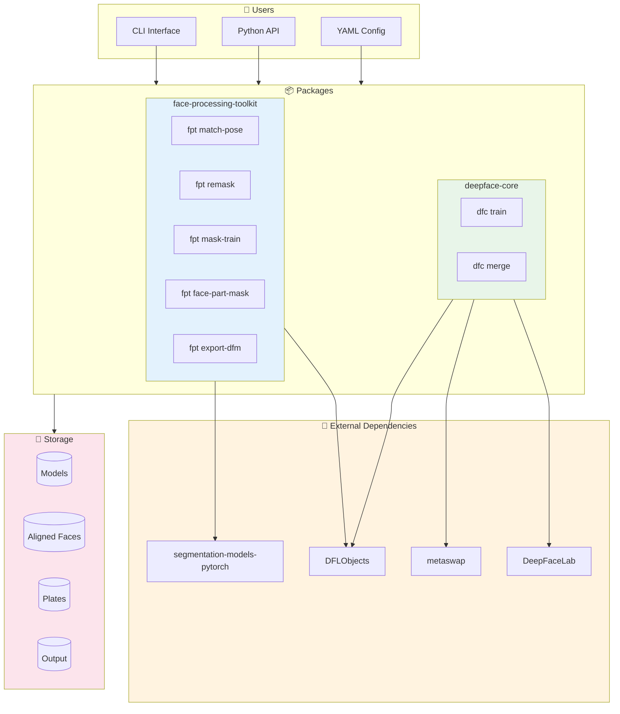

### Package Comparison

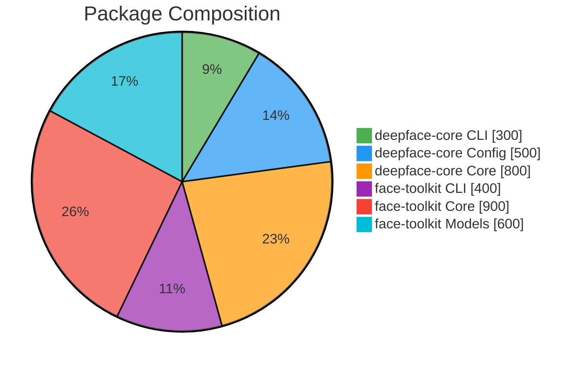

---

## 📦 Package Architecture

### deepface-core Structure

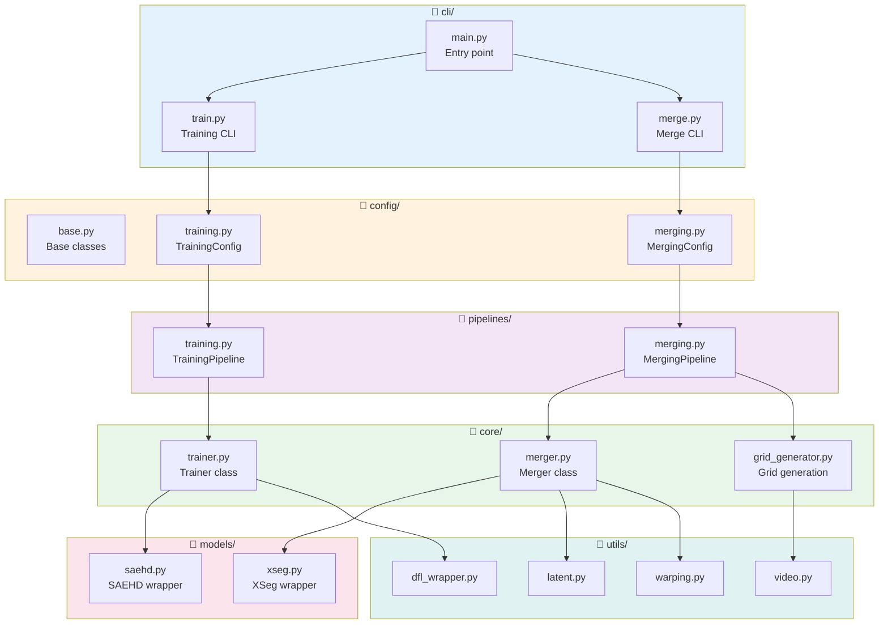

---

### face-processing-toolkit Structure

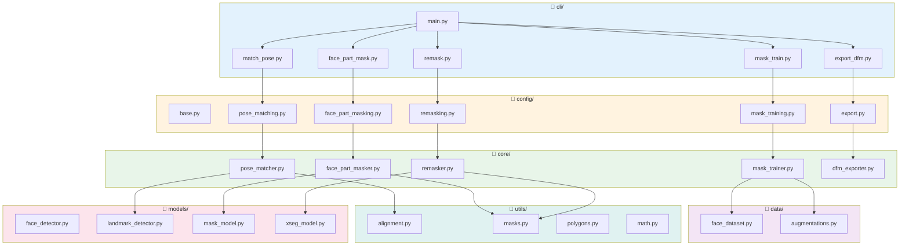

---

## 🔄 Data Flow Diagrams

### Training Pipeline

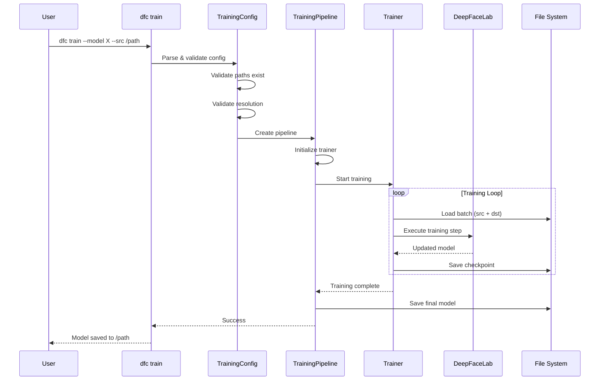

### Merging Pipeline

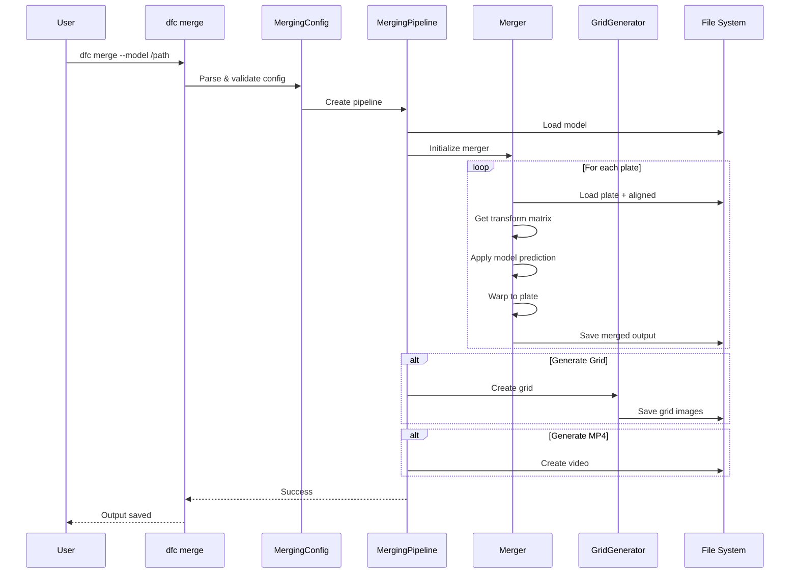

### Face Processing Pipelines

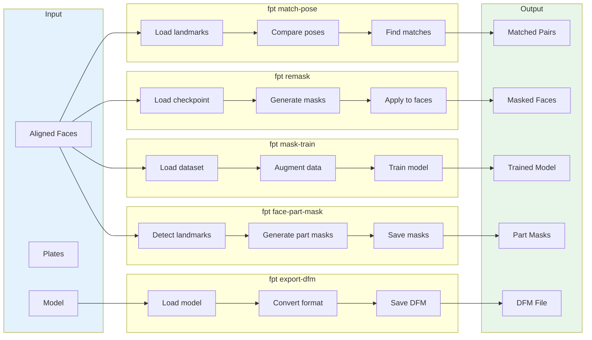

---

## 👥 Team Parallelization

### 6-Week Timeline

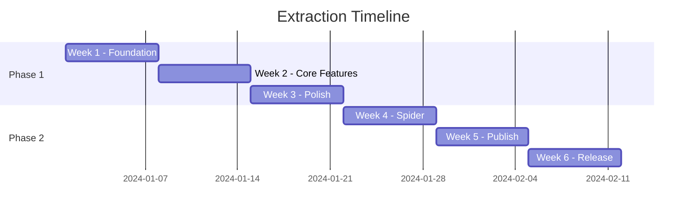

### Developer Assignments

```mermaid
flowchart TB
    subgraph Phase1["Phase 1: Core Packages"]
        subgraph W1["Week 1"]
            D1W1[Dev 1: Package setup<br/>TrainingConfig<br/>Trainer + CLI]
            D2W1[Dev 2: MergingConfig<br/>Merger<br/>rawPredMerge]
            D3W1[Dev 3: face-toolkit setup<br/>alignment utils<br/>match-pose]
        end
        
        subgraph W2["Week 2"]
            D1W2[Dev 1: Checkpoints<br/>Batch training<br/>Resume feature]
            D2W2[Dev 2: Latent utils<br/>Warping<br/>Grid generator]
            D3W2[Dev 3: Remask<br/>Mask train<br/>FP mask<br/>Export DFM]
        end
        
        subgraph W3["Week 3"]
            D1W3[Dev 1: Documentation<br/>Examples<br/>Tests]
            D2W3[Dev 2: Documentation<br/>Benchmarks<br/>Tests]
            D3W3[Dev 3: Documentation<br/>All CLIs<br/>Tests]
        end
    end
    
    subgraph Phase2["Phase 2: Ivy Integration"]
        subgraph W4["Week 4"]
            D1W4[Dev 1: Spider<br/>Query datasets<br/>Query models]
            D2W4[Dev 2: Spider<br/>Query plates<br/>Query aligned]
            D3W4[Dev 3: Spider<br/>Query faces<br/>Query masks]
        end
        
        subgraph W5["Week 5"]
            D1W5[Dev 1: Publish models<br/>Track deps<br/>Model lineage]
            D2W5[Dev 2: Publish merged<br/>Versions<br/>Dependencies]
            D3W5[Dev 3: Publish masks<br/>Publish XSeg<br/>Publish DFMs]
        end
        
        subgraph W6["Week 6"]
            D1W6[Dev 1: Integration tests]
            D2W6[Dev 2: Documentation]
            D3W6[Dev 3: Release]
        end
    end
    
    W1 --> W2 --> W3 --> W4 --> W5 --> W6
    
    style Phase1 fill:#e8f5e9
    style Phase2 fill:#e3f2fd
```

### Deliverables

```mermaid
flowchart LR
    subgraph P1["Phase 1 Deliverables"]
        P1D1[✅ deepface-core package]
        P1D2[✅ face-processing-toolkit]
        P1D3[✅ 7 CLI commands]
        P1D4[✅ Python APIs]
        P1D5[✅ 80% test coverage]
        P1D6[✅ Documentation]
        P1D7[✅ Bob deployment]
    end
    
    subgraph P2["Phase 2 Deliverables"]
        P2D1[✅ Spider adapters]
        P2D2[✅ Publish adapters]
        P2D3[✅ Dependency tracking]
        P2D4[✅ Model lineage]
        P2D5[✅ Backwards compatible]
        P2D6[✅ Integration tests]
    end
    
    P1 --> P2
    
    style P1 fill:#e8f5e9
    style P2 fill:#e3f2fd
```

---

## 🔗 Phase 2: Ivy Integration

### Integration Architecture

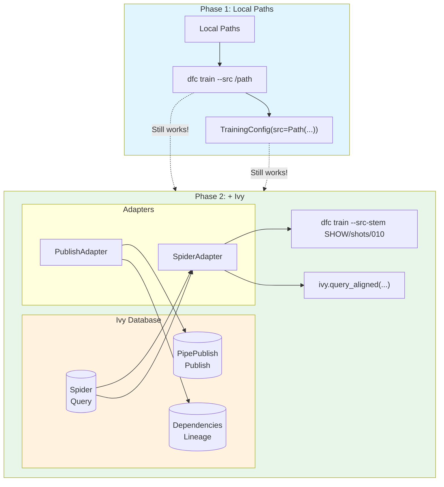

### Backwards Compatibility

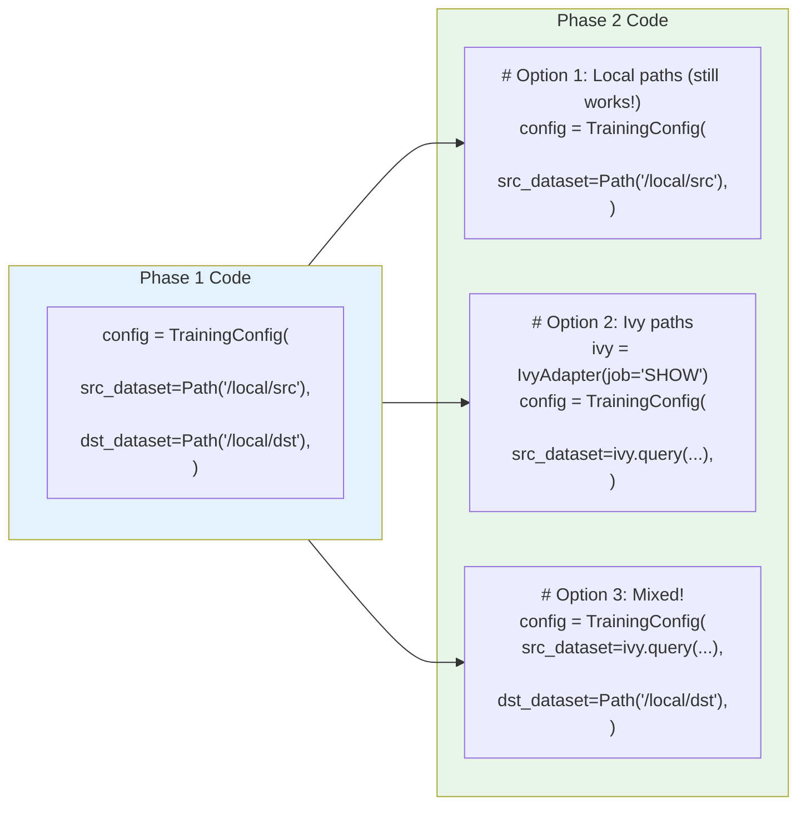

---

**[📖 Extraction Plan](./EXTRACTION_PLAN.md)** • **[📖 Quick Reference](./QUICK_REFERENCE.md)** • **[📁 File Map](./FILE_EXTRACTION_MAP.md)** • **[📋 Summary](./EXTRACTION_SUMMARY.md)**

