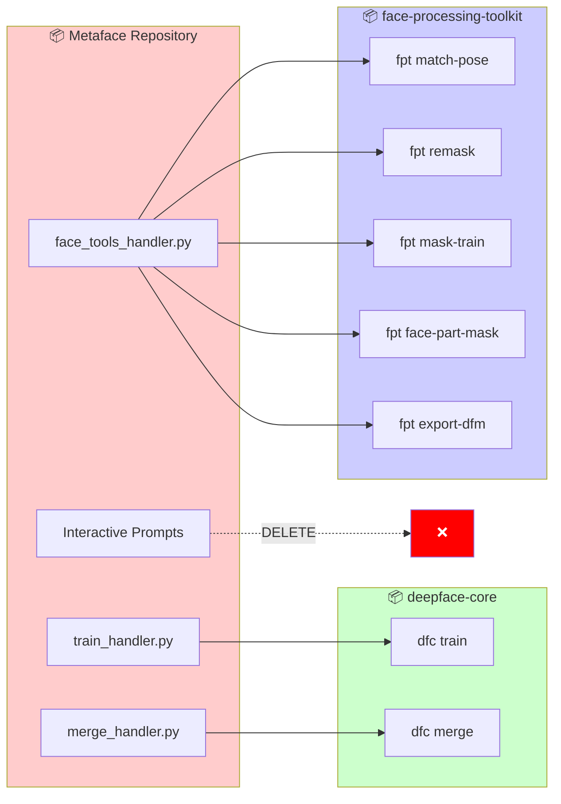
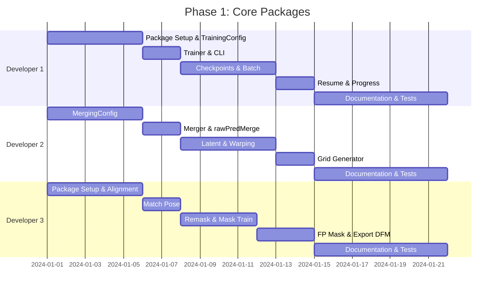
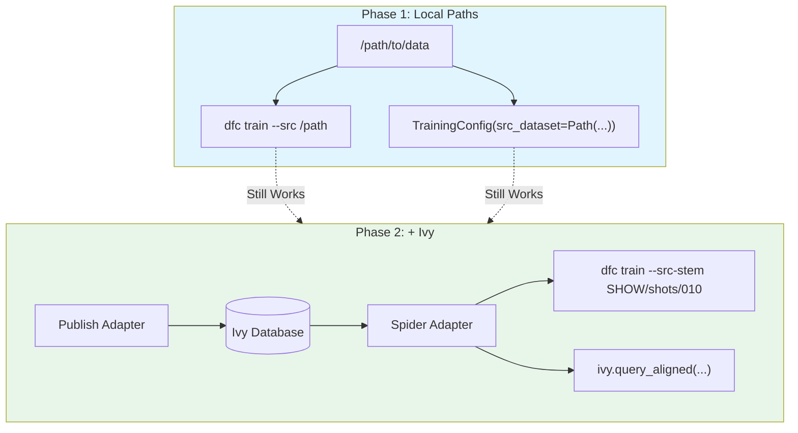
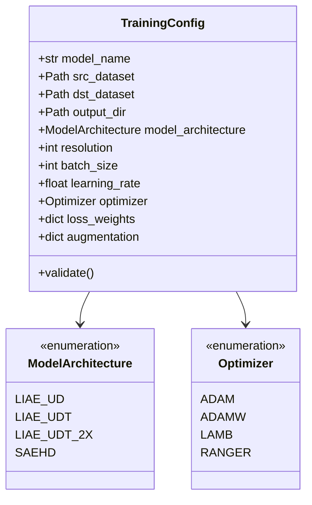
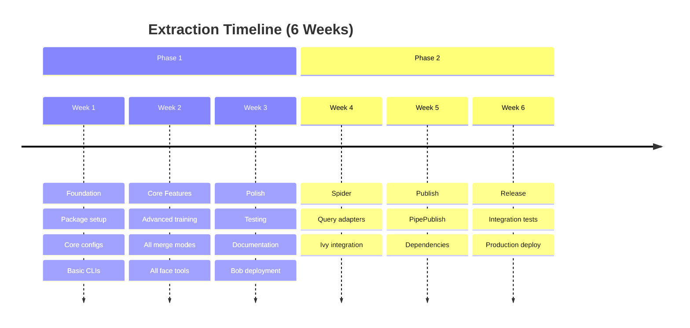

# 🎯 Metaface Core Extraction Plan

<div align="center">


**Extract 7 core deepfake commands into 2 standalone packages**

[Quick Reference](./QUICK_REFERENCE.md) • [Architecture](./ARCHITECTURE_DIAGRAMS.md) • [File Map](./FILE_EXTRACTION_MAP.md) • [Summary](./EXTRACTION_SUMMARY.md)

</div>

---

## 📋 Table of Contents

- [Overview](#-overview)
- [Packages](#-packages)
- [Phase 1: Core Packages](#-phase-1-core-packages)
- [Phase 2: Ivy Integration](#-phase-2-ivy-integration)
- [Configuration Classes](#-configuration-classes)
- [Implementation Timeline](#-implementation-timeline)
- [Bob Deployment](#-bob-deployment)
- [Success Criteria](#-success-criteria)

---

## 🎯 Overview



<table>
<tr>
<td width="50%">

### 📍 Source
| Item | Value |
|:-----|:------|
| **Repository** | Stash |
| **Codebase** | metaface |
| **Lines to Extract** | ~4,000 |
| **Lines to Delete** | ~2,200 |

</td>
<td width="50%">

### 🎯 Target
| Item | Value |
|:-----|:------|
| **Packages** | 2 |
| **Commands** | 7 |
| **Deployment** | Bob |
| **Platform** | platform-pipe2024.1 |

</td>
</tr>
</table>

---

## 📦 Packages

### Package 1: `deepface-core`

> 🧠 **Model training and face merging**

```
📦 deepface-core
├── 📂 src/deepface_core/
│   ├── 📂 cli/                 # Click CLIs
│   │   ├── main.py             # Entry point: dfc
│   │   ├── train.py            # dfc train
│   │   └── merge.py            # dfc merge
│   ├── 📂 config/              # Pydantic configs
│   │   ├── base.py
│   │   ├── training.py         # TrainingConfig
│   │   └── merging.py          # MergingConfig
│   ├── 📂 core/                # Core logic
│   │   ├── trainer.py
│   │   ├── merger.py
│   │   └── grid_generator.py
│   ├── 📂 models/              # Model wrappers
│   │   ├── saehd.py
│   │   └── xseg.py
│   ├── 📂 pipelines/           # High-level APIs
│   │   ├── training.py
│   │   └── merging.py
│   ├── 📂 utils/               # Utilities
│   │   ├── dfl_wrapper.py
│   │   ├── latent.py
│   │   ├── warping.py
│   │   └── ...
│   └── 📂 ivy/                 # Phase 2
│       ├── spider_adapter.py
│       └── publish_adapter.py
├── 📂 tests/
├── 📂 examples/
├── 📂 docs/
├── 📄 pyproject.toml
├── 📄 bob.yaml
└── 📄 README.md
```

<details>
<summary>📋 <b>Dependencies</b></summary>

```toml
[project]
dependencies = [
    "torch>=2.0",
    "torchvision>=0.15",
    "numpy>=1.24",
    "opencv-python>=4.8",
    "pydantic>=2.0",
    "click>=8.0",
    "pyyaml>=6.0",
    "tqdm>=4.65",
    "Pillow>=10.0",
]

[project.optional-dependencies]
ivy = [
    "spider-client",
    "pipepublish",
]
```

**External (via Bob):**
- `metaswap` - Training job configuration
- `DFLObjects` - DFL image handling

</details>

---

### Package 2: `face-processing-toolkit`

> 🎭 **Face processing and masking tools**

```
📦 face-processing-toolkit
├── 📂 src/face_processing_toolkit/
│   ├── 📂 cli/                 # Click CLIs
│   │   ├── main.py             # Entry point: fpt
│   │   ├── match_pose.py
│   │   ├── remask.py
│   │   ├── mask_train.py
│   │   ├── face_part_mask.py
│   │   └── export_dfm.py
│   ├── 📂 config/              # Pydantic configs
│   │   ├── base.py
│   │   ├── pose_matching.py
│   │   ├── remasking.py
│   │   ├── mask_training.py
│   │   ├── face_part_masking.py
│   │   └── export.py
│   ├── 📂 core/                # Core logic
│   │   ├── pose_matcher.py
│   │   ├── remasker.py
│   │   ├── mask_trainer.py
│   │   ├── face_part_masker.py
│   │   └── dfm_exporter.py
│   ├── 📂 models/              # ML models
│   │   ├── face_detector.py
│   │   ├── landmark_detector.py
│   │   ├── mask_model.py
│   │   └── xseg_model.py
│   ├── 📂 data/                # Data handling
│   │   ├── face_dataset.py
│   │   └── augmentations.py
│   ├── 📂 pipelines/           # High-level APIs
│   ├── 📂 utils/               # Utilities
│   │   ├── alignment.py
│   │   ├── masks.py
│   │   ├── polygons.py
│   │   └── math.py
│   └── 📂 ivy/                 # Phase 2
├── 📂 checkpoints/
├── 📂 tests/
├── 📂 examples/
├── 📂 docs/
├── 📄 pyproject.toml
├── 📄 bob.yaml
└── 📄 README.md
```

<details>
<summary>📋 <b>Dependencies</b></summary>

```toml
[project]
dependencies = [
    "torch>=2.0",
    "torchvision>=0.15",
    "numpy>=1.24",
    "opencv-python>=4.8",
    "pydantic>=2.0",
    "click>=8.0",
    "pyyaml>=6.0",
    "tqdm>=4.65",
    "Pillow>=10.0",
    "segmentation-models-pytorch>=0.3",
    "albumentations>=1.3",
    "natsort>=8.0",
]
```

**External (via Bob):**
- `DFLObjects` - DFL image handling

</details>

---

## 🚀 Phase 1: Core Packages

> **Weeks 1-3**: Standalone packages working with any file paths



### Week-by-Week Breakdown

<details>
<summary>📅 <b>Week 1: Foundation</b></summary>

#### Developer 1 - Training
- [ ] Create `deepface-core` package structure
- [ ] Implement `TrainingConfig` with full validation
- [ ] Implement `Trainer` class (DFL wrapper)
- [ ] Create `dfc train` CLI
- [ ] Unit tests for training config

#### Developer 2 - Merging
- [ ] Implement `MergingConfig` with validation
- [ ] Implement `Merger` class
- [ ] Extract `rawPredMerge` logic
- [ ] Create `dfc merge` CLI
- [ ] Unit tests for merging config

#### Developer 3 - Face Tools Setup
- [ ] Create `face-processing-toolkit` package structure
- [ ] Extract alignment utilities
- [ ] Extract math utilities
- [ ] Implement `PoseMatchingConfig`
- [ ] Implement `PoseMatcher` class
- [ ] Create `fpt match-pose` CLI

</details>

<details>
<summary>📅 <b>Week 2: Core Features</b></summary>

#### Developer 1 - Training Advanced
- [ ] Checkpoint management
- [ ] Batch processing
- [ ] Resume training support
- [ ] Progress callbacks
- [ ] `TrainingPipeline` high-level API

#### Developer 2 - Merging Advanced
- [ ] Latent shift utilities
- [ ] Warping utilities
- [ ] Grid generator (all modes)
- [ ] All merge modes
- [ ] `MergingPipeline` high-level API

#### Developer 3 - Face Tools Commands
- [ ] `RemaskingConfig` + `Remasker`
- [ ] `MaskTrainingConfig` + `MaskTrainer`
- [ ] `FacePartMaskingConfig` + `FacePartMasker`
- [ ] `ExportDFMConfig` + `DFMExporter`
- [ ] All remaining CLIs

</details>

<details>
<summary>📅 <b>Week 3: Polish</b></summary>

#### All Developers
- [ ] Integration tests
- [ ] Documentation (README, API docs, examples)
- [ ] Performance benchmarking
- [ ] Type checking (mypy strict mode)
- [ ] Bob deployment configuration
- [ ] Code review and refinement

</details>

---

## 🔗 Phase 2: Ivy Integration

> **Weeks 4-6**: Spider queries + PipePublish (backwards compatible)



### Week-by-Week Breakdown

<details>
<summary>📅 <b>Week 4: Spider Adapters</b></summary>

| Developer | Tasks |
|:----------|:------|
| **Dev 1** | Spider adapter for datasets & models |
| **Dev 2** | Spider adapter for plates & aligned |
| **Dev 3** | Spider adapter for masks & face inputs |

</details>

<details>
<summary>📅 <b>Week 5: Publish Adapters</b></summary>

| Developer | Tasks |
|:----------|:------|
| **Dev 1** | Publish models, dependency tracking, lineage |
| **Dev 2** | Publish merged outputs, versioning |
| **Dev 3** | Publish masks, XSeg models, DFM exports |

</details>

<details>
<summary>📅 <b>Week 6: Integration & Release</b></summary>

| Developer | Tasks |
|:----------|:------|
| **All** | End-to-end integration tests |
| **All** | Documentation updates |
| **All** | Performance testing |
| **All** | Production deployment & release |

</details>

---

## ⚙️ Configuration Classes

### TrainingConfig

> Complete configuration for SAEHD model training



<details>
<summary>📝 <b>Full TrainingConfig Implementation</b></summary>

```python
from pydantic import BaseModel, Field, field_validator
from pathlib import Path
from enum import Enum
from typing import Optional

class ModelArchitecture(str, Enum):
    LIAE_UD = "LIAE_UD"
    LIAE_UDT = "LIAE_UDT"
    LIAE_UDT_2X = "LIAE_UDT_2X"
    SAEHD = "SAEHD"

class Optimizer(str, Enum):
    ADAM = "adam"
    ADAMW = "adamw"
    LAMB = "lamb"
    RANGER = "ranger"

class BorderMode(str, Enum):
    CONSTANT = "constant"
    REPLICATE = "replicate"
    REFLECT = "reflect"

class FreezeMode(str, Enum):
    NONE = "none"
    ENCODER = "encoder"
    INTER_AB = "inter_ab"
    DECODER = "decoder"

class TrainingConfig(BaseModel):
    """Configuration for SAEHD model training."""
    
    # ═══════════════════════════════════════════
    # Required Fields
    # ═══════════════════════════════════════════
    model_name: str = Field(..., description="Name of the model")
    src_dataset: Path = Field(..., description="Path to source aligned faces")
    dst_dataset: Path = Field(..., description="Path to destination aligned faces")
    output_dir: Path = Field(..., description="Output directory for model")
    
    # ═══════════════════════════════════════════
    # Architecture
    # ═══════════════════════════════════════════
    model_architecture: ModelArchitecture = Field(default=ModelArchitecture.LIAE_UDT)
    resolution: int = Field(default=128, ge=64, le=512)
    encoder_dims: int = Field(default=64, ge=16, le=256)
    inter_dims: int = Field(default=128, ge=32, le=1024)
    decoder_dims: int = Field(default=64, ge=16, le=256)
    mask_dims: int = Field(default=22, ge=8, le=64)
    
    # ═══════════════════════════════════════════
    # Training
    # ═══════════════════════════════════════════
    batch_size: int = Field(default=8, ge=1, le=64)
    num_epochs: int = Field(default=0, ge=0, description="0 = indefinite")
    learning_rate: float = Field(default=6e-6, gt=0)
    learning_rate_dropout: bool = Field(default=True)
    
    # ═══════════════════════════════════════════
    # Optimizer
    # ═══════════════════════════════════════════
    optimizer: Optimizer = Field(default=Optimizer.ADAM)
    optimizer_gradient_clip: bool = Field(default=True)
    optimizer_gradient_clip_value: float = Field(default=1.0)
    
    # ═══════════════════════════════════════════
    # Loss Weights
    # ═══════════════════════════════════════════
    loss_weight_ssim: float = Field(default=0.0, ge=0)
    loss_weight_style: float = Field(default=0.0, ge=0)
    loss_weight_dssim: float = Field(default=10.0, ge=0)
    loss_weight_ms_ssim: float = Field(default=0.0, ge=0)
    loss_weight_mse: float = Field(default=0.0, ge=0)
    loss_weight_mae: float = Field(default=0.0, ge=0)
    loss_weight_idleak: float = Field(default=0.0, ge=0)
    loss_weight_lpips: float = Field(default=0.0, ge=0)
    loss_weight_src: float = Field(default=1.0, ge=0)
    loss_weight_dst: float = Field(default=1.0, ge=0)
    
    # ═══════════════════════════════════════════
    # Augmentation
    # ═══════════════════════════════════════════
    border_mode: BorderMode = Field(default=BorderMode.REPLICATE)
    uniform_yaw: bool = Field(default=False)
    random_blur: bool = Field(default=False)
    random_blur_chance: float = Field(default=0.5, ge=0, le=1)
    random_flip: bool = Field(default=True)
    random_downsample: bool = Field(default=False)
    random_downsample_chance: float = Field(default=0.5, ge=0, le=1)
    random_noise: bool = Field(default=False)
    random_noise_chance: float = Field(default=0.5, ge=0, le=1)
    random_warp: bool = Field(default=True)
    random_warp_samples: int = Field(default=3, ge=1, le=10)
    random_warp_scale: float = Field(default=0.05, ge=0, le=0.5)
    random_transform: bool = Field(default=True)
    random_transform_rotation: float = Field(default=5.0, ge=0, le=45)
    random_transform_scale: float = Field(default=0.05, ge=0, le=0.5)
    random_transform_translate: float = Field(default=0.05, ge=0, le=0.5)
    
    # ═══════════════════════════════════════════
    # Advanced
    # ═══════════════════════════════════════════
    masked_training: bool = Field(default=True)
    background_grayscaling: bool = Field(default=False)
    freeze_mode: FreezeMode = Field(default=FreezeMode.NONE)
    use_fp16: bool = Field(default=False)
    
    # ═══════════════════════════════════════════
    # Checkpoints
    # ═══════════════════════════════════════════
    output_interval_minutes: int = Field(default=15, ge=1)
    checkpoint_interval_hours: int = Field(default=4, ge=1)
    checkpoint_count: int = Field(default=4, ge=1)
    preview_images_count: int = Field(default=4, ge=1, le=16)
    
    # ═══════════════════════════════════════════
    # Resume
    # ═══════════════════════════════════════════
    model_path: Optional[Path] = Field(default=None)
    
    @field_validator('src_dataset', 'dst_dataset')
    @classmethod
    def validate_dataset_exists(cls, v: Path) -> Path:
        if not v.exists():
            raise ValueError(f"Dataset path does not exist: {v}")
        return v
    
    @field_validator('resolution')
    @classmethod
    def validate_resolution(cls, v: int) -> int:
        valid = [64, 96, 128, 160, 192, 224, 256, 288, 320, 352, 384, 416, 448, 480, 512]
        if v not in valid:
            raise ValueError(f"Resolution must be one of {valid}")
        return v
```

</details>

---

### MergingConfig

> Complete configuration for face merging

<details>
<summary>📝 <b>Full MergingConfig Implementation</b></summary>

```python
from pydantic import BaseModel, Field, field_validator
from pathlib import Path
from enum import Enum
from typing import Optional

class MergeMode(str, Enum):
    RAW_RGB = "raw_rgb"
    RAW_PRED = "raw_pred"
    RAW_RGB_PRED = "raw_rgb+pred"
    SEAMLESS = "seamless"

class Interpolator(str, Enum):
    NEAREST = "nearest"
    LINEAR = "linear"
    CUBIC = "cubic"
    AREA = "area"
    LANCZOS4 = "lanczos4"

class MergingConfig(BaseModel):
    """Configuration for face merging."""
    
    # Required
    model_path: Path = Field(..., description="Path to trained model")
    plates_dir: Path = Field(..., description="Path to plate images")
    aligned_dir: Path = Field(..., description="Path to aligned faces")
    output_dir: Path = Field(..., description="Output directory")
    
    # Mode
    merge_mode: MergeMode = Field(default=MergeMode.RAW_RGB)
    merge_on_alignments: bool = Field(default=False)
    is_degradation_merge: bool = Field(default=False)
    
    # Latent
    latent_shift_file: Optional[Path] = Field(default=None)
    latent_shift_scale: float = Field(default=1.0, ge=0, le=2)
    
    # Warping
    enable_warp: bool = Field(default=False)
    n_matches_to_warp: int = Field(default=3, ge=1, le=10)
    dataset_src_to_warp: Optional[Path] = Field(default=None)
    
    # Grid
    generate_grid: bool = Field(default=False)
    generate_yaw_grid: bool = Field(default=False)
    generate_mask_grid: bool = Field(default=False)
    
    # Output
    generate_mp4: bool = Field(default=False)
    mp4_quality: str = Field(default="normal", pattern="^(low|normal|high)$")
    
    # Batch
    batch_size: int = Field(default=8, ge=1, le=64)
    
    # Advanced
    interpolator: Interpolator = Field(default=Interpolator.LANCZOS4)
    rescale_output: bool = Field(default=False)
```

</details>

---

### Face Processing Configs

<details>
<summary>📝 <b>All Face Processing Configurations</b></summary>

```python
# ═══════════════════════════════════════════════════════════════
# Pose Matching
# ═══════════════════════════════════════════════════════════════
class PoseMatchingConfig(BaseModel):
    src_dir: Path
    dst_dir: Path
    output_dir: Path
    similarity_threshold: float = Field(default=0.8, ge=0, le=1)
    max_matches: int = Field(default=10, ge=1)
    use_3d_landmarks: bool = Field(default=True)

# ═══════════════════════════════════════════════════════════════
# Remasking
# ═══════════════════════════════════════════════════════════════
class RemaskingConfig(BaseModel):
    input_dir: Path
    checkpoint_path: Path
    features: list[str] = Field(default=["face"])
    batch_size: int = Field(default=16, ge=1)

# ═══════════════════════════════════════════════════════════════
# Mask Training
# ═══════════════════════════════════════════════════════════════
class MaskTrainingConfig(BaseModel):
    training_data_paths: list[Path]
    output_dir: Path
    epochs: int = Field(default=100, ge=1)
    batch_size: int = Field(default=8, ge=1)
    learning_rate: float = Field(default=1e-4, gt=0)
    resolution: tuple[int, int] = Field(default=(512, 512))

# ═══════════════════════════════════════════════════════════════
# Face Part Masking
# ═══════════════════════════════════════════════════════════════
class FacePartMaskingConfig(BaseModel):
    input_folder: Path
    features: list[str]
    mask_type: str = Field(default="both", pattern="^(aligned|plate|both)$")
    checkpoint_path: Path
    plates_folder: Optional[Path] = None

# ═══════════════════════════════════════════════════════════════
# Export DFM
# ═══════════════════════════════════════════════════════════════
class ExportDFMConfig(BaseModel):
    model_path: Path
    output_path: Path
    include_latent_support: bool = Field(default=True)
```

</details>

---

## 📅 Implementation Timeline



---

## 🚢 Bob Deployment

### deepface-core

```yaml
# bob.yaml
name: deepface-core
version: "1.0.0"

requires:
  - platform-pipe2024.1
  - python-3.10
  - torch-2.0
  - metaswap
  - DFLObjects

build:
  type: python
  entry_points:
    dfc: deepface_core.cli.main:cli

variants:
  - platform: [linux]
    arch: [x86_64]
```

### face-processing-toolkit

```yaml
# bob.yaml
name: face-processing-toolkit
version: "1.0.0"

requires:
  - platform-pipe2024.1
  - python-3.10
  - torch-2.0
  - DFLObjects
  - segmentation-models-pytorch

build:
  type: python
  entry_points:
    fpt: face_processing_toolkit.cli.main:cli

variants:
  - platform: [linux]
    arch: [x86_64]
```

---

## ✅ Success Criteria

### Phase 1

| Criteria | Status |
|:---------|:------:|
| Both packages deployed via Bob | ⬜ |
| All 7 commands functional via CLI | ⬜ |
| Python APIs available for all commands | ⬜ |
| Zero interactive prompts | ⬜ |
| Type-safe Pydantic configuration | ⬜ |
| 80%+ test coverage | ⬜ |
| Complete documentation | ⬜ |

### Phase 2

| Criteria | Status |
|:---------|:------:|
| Spider queries working | ⬜ |
| PipePublish working | ⬜ |
| Dependency tracking | ⬜ |
| Backwards compatible with Phase 1 | ⬜ |
| Integration tests passing | ⬜ |

---

## ❓ Questions for Stakeholders

> [!IMPORTANT]
> These questions need answers before implementation begins

| # | Question | Status |
|:-:|:---------|:------:|
| 1 | Stash repository location and naming convention | ⬜ |
| 2 | Confirm `platform-pipe2024.1` as Bob target | ⬜ |
| 3 | Is `metaswap` package available via Bob? | ⬜ |
| 4 | Ivy TwigType codes for models, aligned faces, outputs | ⬜ |

---

<div align="center">

**[📖 Quick Reference](./QUICK_REFERENCE.md)** • **[🏗️ Architecture](./ARCHITECTURE_DIAGRAMS.md)** • **[📁 File Map](./FILE_EXTRACTION_MAP.md)** • **[📋 Summary](./EXTRACTION_SUMMARY.md)**

</div>
