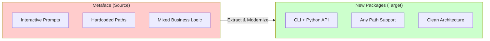
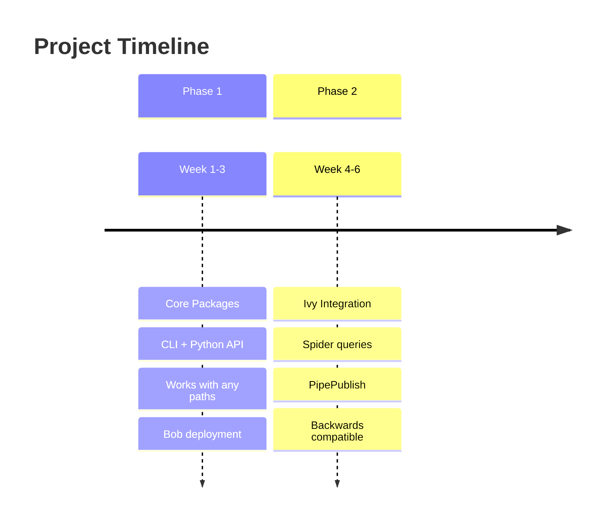
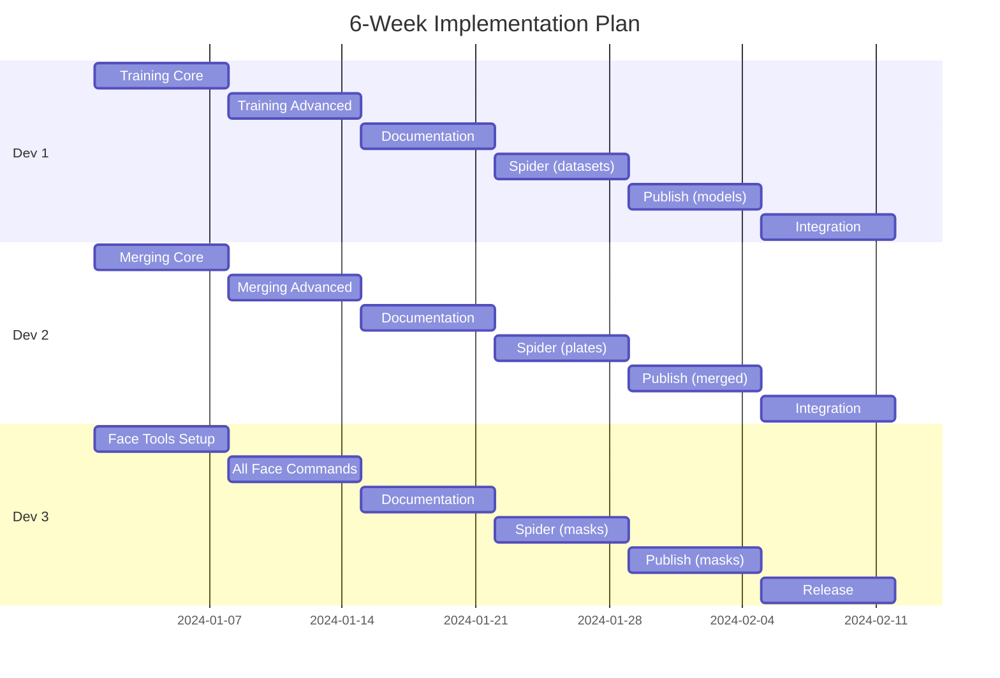

# 📋 Metaface Core Extraction - Executive Summary

<div align="center">


**Executive summary for stakeholders and team leads**

[Extraction Plan](./EXTRACTION_PLAN.md) • [Architecture](./ARCHITECTURE_DIAGRAMS.md) • [Quick Reference](./QUICK_REFERENCE.md) • [File Map](./FILE_EXTRACTION_MAP.md)

</div>

---

## 🎯 Overview

Extract **7 core deepfake commands** from the metaface repository into **2 standalone packages** deployed via **Bob**.



---

## 📦 Packages

<table>
<tr>
<td width="50%" valign="top">

### 🧠 deepface-core

**Model training and face merging**

| Command | Description |
|:--------|:------------|
| `dfc train` | Train SAEHD models |
| `dfc merge` | Merge onto plates |

**Key Features:**
- Complete training configuration (50+ params)
- All merge modes (raw_rgb, raw_pred, seamless)
- Grid generation
- Video output

</td>
<td width="50%" valign="top">

### 🎭 face-processing-toolkit

**Face processing and masking tools**

| Command | Description |
|:--------|:------------|
| `fpt match-pose` | Match poses |
| `fpt remask` | Apply XSeg masks |
| `fpt mask-train` | Train mask models |
| `fpt face-part-mask` | Generate part masks |
| `fpt export-dfm` | Export to DFM |

</td>
</tr>
</table>

---

## 📅 Two-Phase Approach



### Phase 1: Core Packages (Weeks 1-3)

> Standalone packages working with **any file paths**

- ✅ CLI interfaces via Click
- ✅ Python APIs for scripting
- ✅ Type-safe configuration via Pydantic
- ✅ Comprehensive test coverage
- ✅ Deployed via Bob

### Phase 2: Ivy Integration (Weeks 4-6)

> Spider queries + PipePublish (**backwards compatible**)

- ✅ Query datasets/models from Ivy
- ✅ Publish outputs to Ivy
- ✅ Dependency tracking
- ✅ Model lineage
- ✅ Local paths still work!

---

## 👥 Team & Timeline



---

## 📊 Key Metrics

<table>
<tr>
<td width="33%" align="center">

### 📉 Before

```
Interactive prompts: ~2,200 lines
Hardcoded paths: Many
Type safety: ~10%
Test coverage: ~20%
```

</td>
<td width="33%" align="center">

### 📈 After

```
Interactive prompts: 0
Hardcoded paths: 0
Type safety: 100%
Test coverage: 80%+
```

</td>
<td width="33%" align="center">

### 📦 New Code

```
Total files: ~62
Total lines: ~8,400
Extracted: ~4,000 lines
Deleted: ~2,200 lines
```

</td>
</tr>
</table>

---

## ✅ Success Criteria

### Phase 1 Checklist

| Criteria | Status |
|:---------|:------:|
| Both packages deployed via Bob | ⬜ |
| All 7 commands functional via CLI | ⬜ |
| Python APIs available | ⬜ |
| Zero interactive prompts | ⬜ |
| Type-safe Pydantic configuration | ⬜ |
| 80%+ test coverage | ⬜ |
| Complete documentation | ⬜ |

### Phase 2 Checklist

| Criteria | Status |
|:---------|:------:|
| Spider queries working | ⬜ |
| PipePublish working | ⬜ |
| Dependency tracking | ⬜ |
| Backwards compatible | ⬜ |
| Integration tests passing | ⬜ |

---

## 🔧 Technical Decisions

### Architecture

| Decision | Rationale |
|:---------|:----------|
| **Two packages** | Separation of concerns: training/merging vs face processing |
| **Click for CLI** | Standard, well-documented, extensible |
| **Pydantic for config** | Type safety, validation, serialization |
| **DFL subprocess** | Preserve existing functionality, minimize risk |

### Dependencies

| Package | External Dependencies |
|:--------|:---------------------|
| `deepface-core` | metaswap, DFLObjects |
| `face-processing-toolkit` | DFLObjects, segmentation-models-pytorch |

### Deployment

| Item | Value |
|:-----|:------|
| **Repository** | Stash |
| **Deployment** | Bob artefacts |
| **Platform** | platform-pipe2024.1 |

---

## ❓ Questions for Stakeholders

> [!IMPORTANT]
> These questions need answers before implementation begins

| # | Question | Priority |
|:-:|:---------|:--------:|
| 1 | Stash repository location and naming | 🔴 High |
| 2 | Confirm Bob platform target | 🔴 High |
| 3 | dfl availability via Bob | 🔴 High |
| 4 | Checkpoint storage location | 🟡 Medium |
| 5 | Ivy TwigType codes | 🟡 Medium |

---

## 📚 Documentation

| Document | Description |
|:---------|:------------|
| [📖 Extraction Plan](./EXTRACTION_PLAN.md) | Complete extraction plan with configs and timeline |
| [🏗️ Architecture Diagrams](./ARCHITECTURE_DIAGRAMS.md) | Visual architecture documentation |
| [📖 Quick Reference](./QUICK_REFERENCE.md) | CLI commands and Python API examples |
| [📁 File Extraction Map](./FILE_EXTRACTION_MAP.md) | Detailed source-to-target file mapping |

---

## 🚀 Next Steps

1. **Get answers** to stakeholder questions
2. **Create repositories** in Stash
3. **Set up CI/CD** for Bob deployment
4. **Begin Week 1** implementation

---

<div align="center">

### Ready for Implementation ✅

**[📖 Extraction Plan](./EXTRACTION_PLAN.md)** • **[🏗️ Architecture](./ARCHITECTURE_DIAGRAMS.md)** • **[📖 Quick Reference](./QUICK_REFERENCE.md)** • **[📁 File Map](./FILE_EXTRACTION_MAP.md)**

</div>
