# 📁 File Extraction Map

**Detailed mapping from metaface source files to new package locations**

[Extraction Plan](./EXTRACTION_PLAN.md) • [Architecture](./ARCHITECTURE_DIAGRAMS.md) • [Quick Reference](./QUICK_REFERENCE.md) • [Summary](./EXTRACTION_SUMMARY.md)

---

## 📋 Table of Contents

- [Legend](#-legend)
- [deepface-core](#-deepface-core)
- [face-processing-toolkit](#-face-processing-toolkit)
- [Shared Utilities](#-shared-utilities)
- [Files to Delete](#-files-to-delete)
- [Priority Order](#-priority-order)
- [Summary](#-summary)

---

## 🏷️ Legend

| Badge | Action | Description |
|:-----:|:-------|:------------|
| 🟢 | **EXTRACT** | Core logic to extract and modernize |
| 🔴 | **DELETE** | Interactive prompts/telemetry - do not extract |
| 🔵 | **NEW** | New file to create |
| 🟣 | **MERGE** | Combine multiple source files |

---

## 📦 deepface-core

### CLI Layer

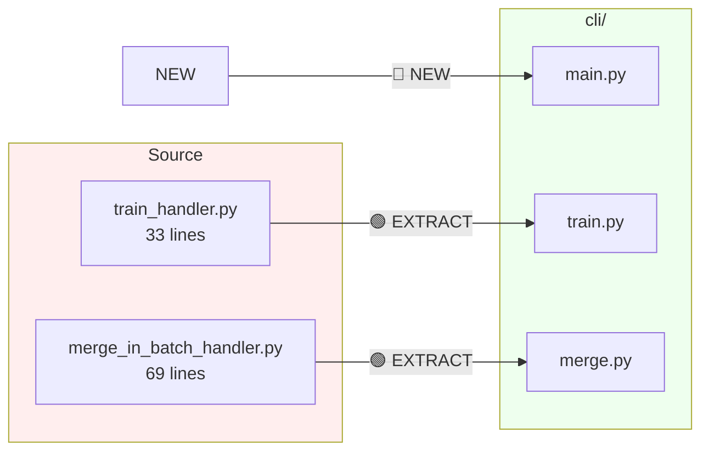

| Target | Source | Action | Lines | Notes |
|:-------|:-------|:------:|------:|:------|
| `cli/main.py` | - | 🔵 NEW | ~50 | Click group entry point |
| `cli/train.py` | `train_handler.py` | 🟢 EXTRACT | 33 | Convert to Click command |
| `cli/merge.py` | `merge_in_batch_handler.py` | 🟢 EXTRACT | 69 | Convert to Click command |

---

### Config Layer

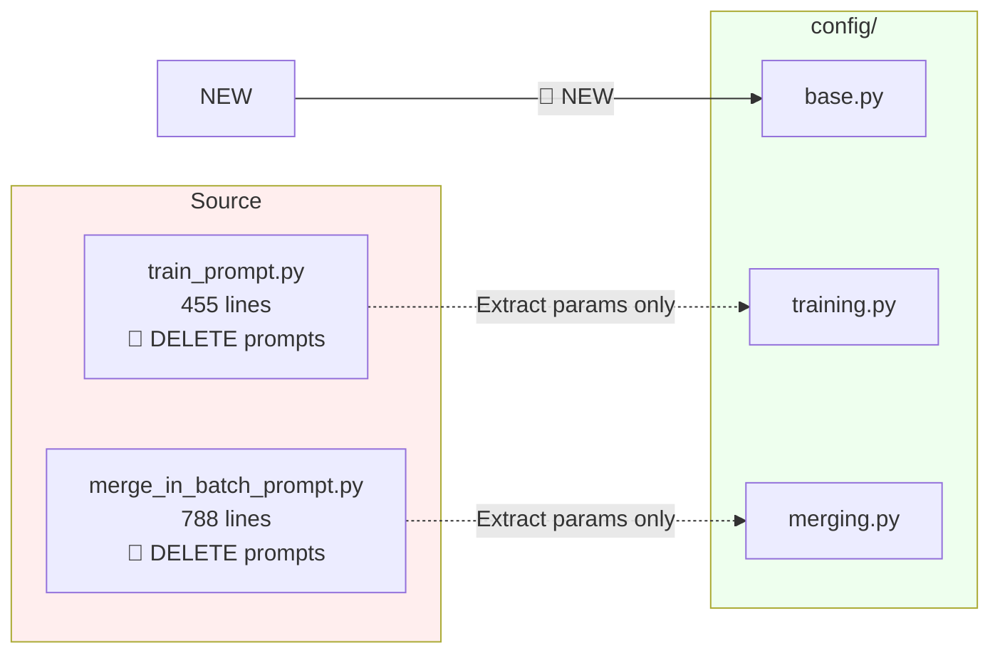

| Target | Source | Action | Lines | Notes |
|:-------|:-------|:------:|------:|:------|
| `config/base.py` | - | 🔵 NEW | ~100 | Base config classes, enums |
| `config/training.py` | `train_prompt.py` | 🟢 EXTRACT | 455 | Extract parameters only, delete prompts |
| `config/merging.py` | `merge_in_batch_prompt.py` | 🟢 EXTRACT | 788 | Extract parameters only, delete prompts |

---

### Core Layer

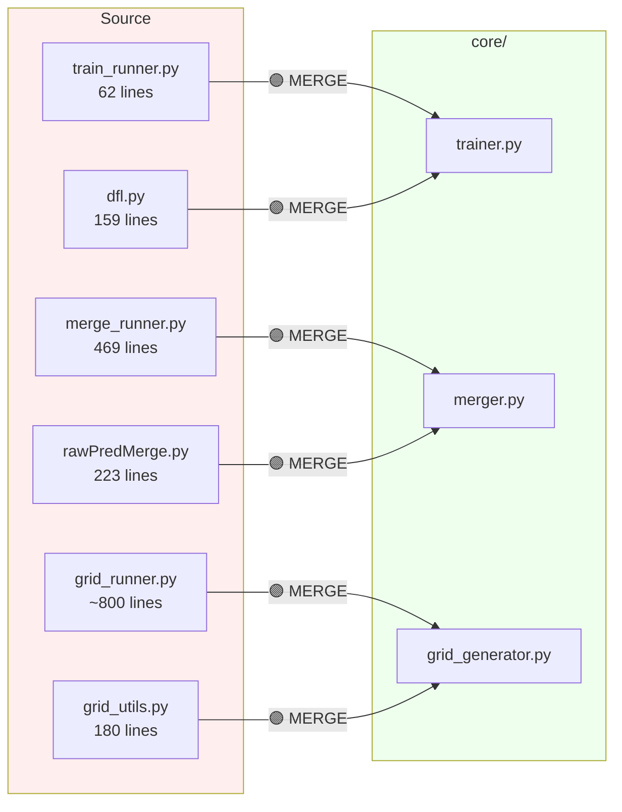

| Target | Source | Action | Lines | Notes |
|:-------|:-------|:------:|------:|:------|
| `core/trainer.py` | `train_runner.py`, `dfl.py` | 🟣 MERGE | 221 | DFL command execution |
| `core/merger.py` | `merge_runner.py`, `rawPredMerge.py` | 🟣 MERGE | 692 | All merge logic |
| `core/grid_generator.py` | `grid_runner.py`, `grid_utils.py` | 🟣 MERGE | ~980 | Grid generation |

---

### Models Layer

| Target | Source | Action | Lines | Notes |
|:-------|:-------|:------:|------:|:------|
| `models/saehd.py` | - | 🔵 NEW | ~100 | SAEHD model wrapper |
| `models/xseg.py` | - | 🔵 NEW | ~100 | XSeg model wrapper |

---

### Pipelines Layer

| Target | Source | Action | Lines | Notes |
|:-------|:-------|:------:|------:|:------|
| `pipelines/training.py` | - | 🔵 NEW | ~150 | High-level training API |
| `pipelines/merging.py` | - | 🔵 NEW | ~150 | High-level merging API |

---

### Utils Layer

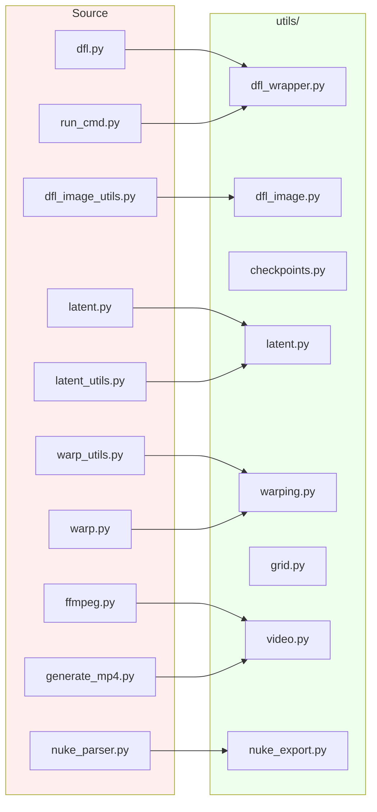

| Target | Source | Action | Lines | Notes |
|:-------|:-------|:------:|------:|:------|
| `utils/dfl_wrapper.py` | `dfl.py`, `run_cmd.py` | 🟣 MERGE | ~200 | DFL execution wrapper |
| `utils/dfl_image.py` | `dfl_image_utils.py` | 🟢 EXTRACT | 120 | DFL image utilities |
| `utils/checkpoints.py` | - | 🔵 NEW | ~100 | Checkpoint management |
| `utils/latent.py` | `latent.py`, `latent_utils.py` | 🟣 MERGE | ~200 | Latent manipulation |
| `utils/warping.py` | `warp_utils.py`, `warp.py` | 🟣 MERGE | ~250 | Warp calculations |
| `utils/grid.py` | `grid_utils.py` | 🟢 EXTRACT | 180 | Grid utilities |
| `utils/video.py` | `ffmpeg.py`, `generate_mp4.py` | 🟣 MERGE | ~250 | Video generation |
| `utils/nuke_export.py` | `nuke_parser.py` | 🟢 EXTRACT | 150 | Nuke tracker export |

---

### Ivy Layer (Phase 2)

| Target | Source | Action | Lines | Notes |
|:-------|:-------|:------:|------:|:------|
| `ivy/spider_adapter.py` | - | 🔵 NEW | ~150 | Spider query adapter |
| `ivy/publish_adapter.py` | - | 🔵 NEW | ~150 | PipePublish adapter |

---

## 🎭 face-processing-toolkit

### CLI Layer

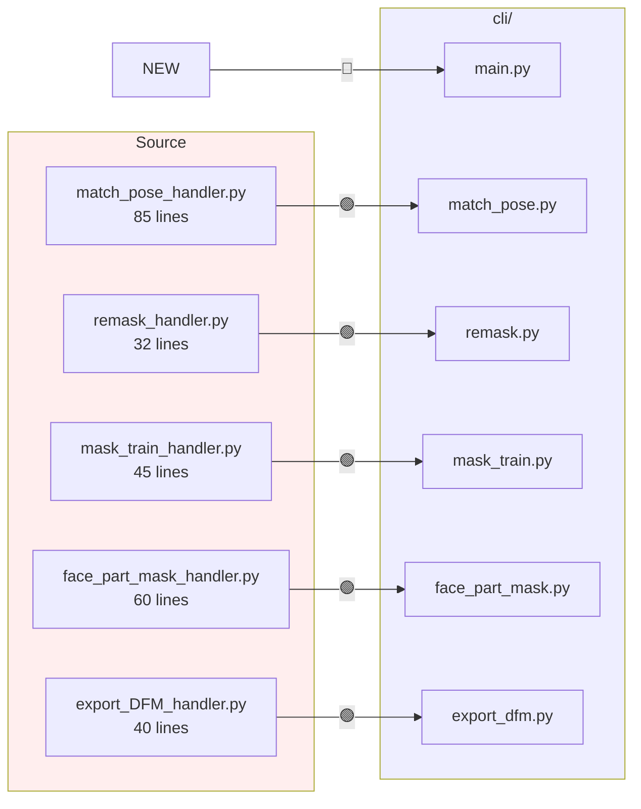

| Target | Source | Action | Lines | Notes |
|:-------|:-------|:------:|------:|:------|
| `cli/main.py` | - | 🔵 NEW | ~50 | Click group entry point |
| `cli/match_pose.py` | `match_pose_handler.py` | 🟢 EXTRACT | 85 | Convert to Click |
| `cli/remask.py` | `remask_handler.py` | 🟢 EXTRACT | 32 | Convert to Click |
| `cli/mask_train.py` | `mask_train_handler.py` | 🟢 EXTRACT | 45 | Convert to Click |
| `cli/face_part_mask.py` | `face_part_mask_handler.py` | 🟢 EXTRACT | 60 | Convert to Click |
| `cli/export_dfm.py` | `export_DFM_handler.py` | 🟢 EXTRACT | 40 | Convert to Click |

---

### Config Layer

| Target | Source | Action | Lines | Notes |
|:-------|:-------|:------:|------:|:------|
| `config/base.py` | - | 🔵 NEW | ~50 | Base config classes |
| `config/pose_matching.py` | `match_pose_prompt.py` | 🟢 EXTRACT | ~80 | Extract parameters |
| `config/remasking.py` | `remask_prompt.py` | 🟢 EXTRACT | ~60 | Extract parameters |
| `config/mask_training.py` | `mask_train_prompt.py` | 🟢 EXTRACT | ~100 | Extract parameters |
| `config/face_part_masking.py` | `face_part_mask_prompt.py` | 🟢 EXTRACT | ~80 | Extract parameters |
| `config/export.py` | `export_DFM_prompt.py` | 🟢 EXTRACT | ~50 | Extract parameters |

---

### Core Layer

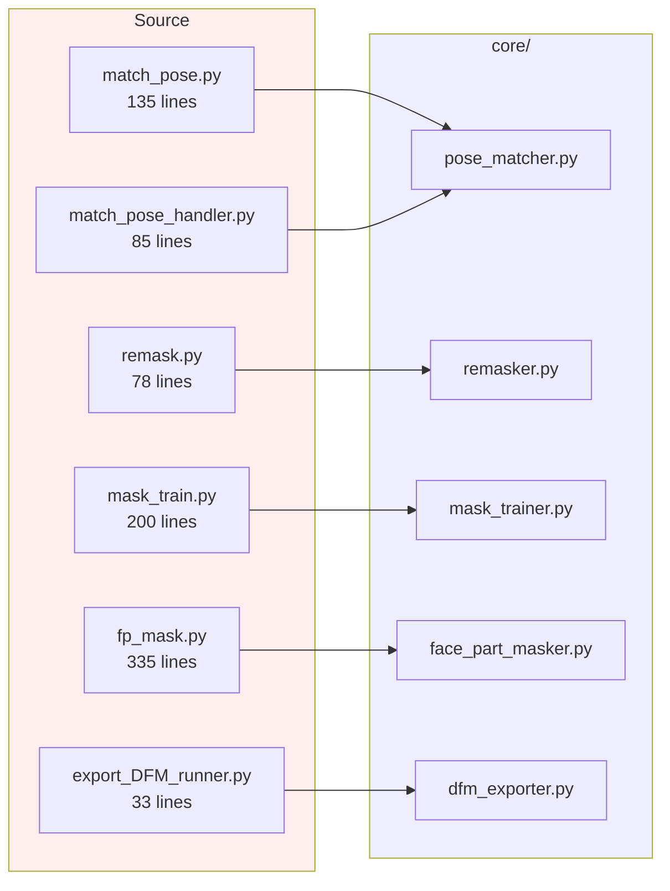

| Target | Source | Action | Lines | Notes |
|:-------|:-------|:------:|------:|:------|
| `core/pose_matcher.py` | `match_pose.py`, `match_pose_handler.py` | 🟣 MERGE | 220 | Pose matching logic |
| `core/remasker.py` | `remask.py` | 🟢 EXTRACT | 78 | XSeg remask logic |
| `core/mask_trainer.py` | `mask_train.py` | 🟢 EXTRACT | 200 | Mask training logic |
| `core/face_part_masker.py` | `fp_mask.py` | 🟢 EXTRACT | 335 | Face part masking |
| `core/dfm_exporter.py` | `export_DFM_runner.py` | 🟢 EXTRACT | 33 | DFM export |

---

### Models Layer

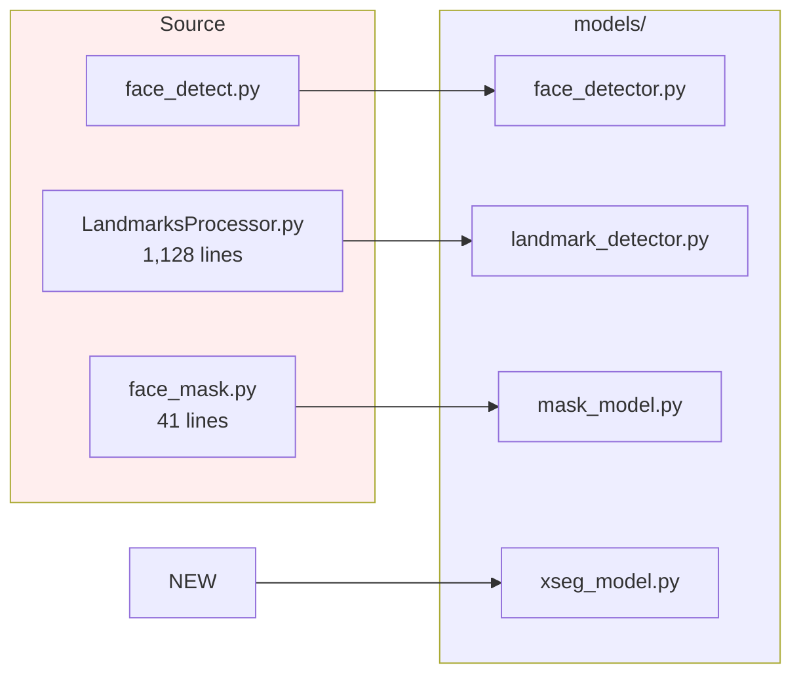

| Target | Source | Action | Lines | Notes |
|:-------|:-------|:------:|------:|:------|
| `models/face_detector.py` | `face_detect.py` | 🟢 EXTRACT | ~150 | Face detection |
| `models/landmark_detector.py` | `LandmarksProcessor.py` | 🟢 EXTRACT | 1,128 | Landmark detection |
| `models/mask_model.py` | `face_mask.py` | 🟢 EXTRACT | 41 | DeepLabV3+ masking |
| `models/xseg_model.py` | - | 🔵 NEW | ~100 | XSeg model wrapper |

---

### Data Layer

| Target | Source | Action | Lines | Notes |
|:-------|:-------|:------:|------:|:------|
| `data/face_dataset.py` | `dataset.py` | 🟢 EXTRACT | 104 | PyTorch dataset |
| `data/augmentations.py` | `augmentations.py` | 🟢 EXTRACT | 267 | Training augmentations |

---

### Pipelines Layer

| Target | Source | Action | Lines | Notes |
|:-------|:-------|:------:|------:|:------|
| `pipelines/pose_matching.py` | - | 🔵 NEW | ~80 | High-level API |
| `pipelines/remasking.py` | - | 🔵 NEW | ~80 | High-level API |
| `pipelines/mask_training.py` | - | 🔵 NEW | ~80 | High-level API |
| `pipelines/face_part_masking.py` | - | 🔵 NEW | ~80 | High-level API |
| `pipelines/export.py` | - | 🔵 NEW | ~80 | High-level API |

---

### Utils Layer

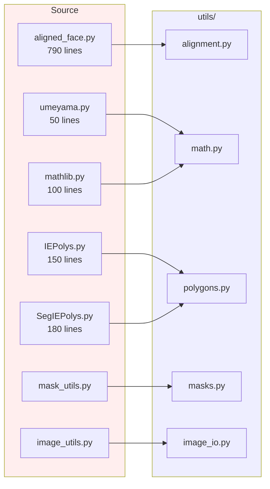

| Target | Source | Action | Lines | Notes |
|:-------|:-------|:------:|------:|:------|
| `utils/alignment.py` | `aligned_face.py` | 🟢 EXTRACT | 790 | Face alignment math |
| `utils/masks.py` | `mask_utils.py` | 🟢 EXTRACT | ~100 | Mask utilities |
| `utils/polygons.py` | `IEPolys.py`, `SegIEPolys.py` | 🟣 MERGE | 330 | Polygon handling |
| `utils/math.py` | `umeyama.py`, `mathlib.py` | 🟣 MERGE | 150 | Math utilities |
| `utils/image_io.py` | `image_utils.py` | 🟢 EXTRACT | ~150 | Image I/O |

---

## 🔄 Shared Utilities

> Files used by both packages - extract to each package or create shared library

| Source | Lines | Used By | Target |
|:-------|------:|:--------|:-------|
| `image_utils.py` | ~150 | Both | `utils/image_io.py` in each |
| `folder_utils.py` | ~100 | Both | `utils/paths.py` in each |
| `batched.py` | ~50 | Both | `utils/batched.py` in each |

---

## 🗑️ Files to Delete

> [!CAUTION]
> These files contain interactive prompts, telemetry, or workflow-specific logic and should NOT be extracted

### Interactive Prompts

🔴 <b>All *_prompt.py files (~2,200 lines total)</b>

| File | Lines | Reason |
|:-----|------:|:-------|
| `train_prompt.py` | 455 | InquirerPy prompts |
| `merge_in_batch_prompt.py` | 788 | InquirerPy prompts |
| `match_pose_prompt.py` | ~100 | InquirerPy prompts |
| `remask_prompt.py` | ~80 | InquirerPy prompts |
| `mask_train_prompt.py` | ~120 | InquirerPy prompts |
| `face_part_mask_prompt.py` | ~90 | InquirerPy prompts |
| `export_DFM_prompt.py` | ~60 | InquirerPy prompts |
| `extract_prompt.py` | ~200 | InquirerPy prompts |
| All other `*_prompt.py` | ~300 | InquirerPy prompts |

### Telemetry & Workflow

🔴 <b>Telemetry and workflow-specific files</b>

| File | Lines | Reason |
|:-----|------:|:-------|
| `tracking.py` | ~200 | Telemetry |
| `slack_metaface_app.py` | ~150 | Slack integration |
| `progress_handler.py` | ~100 | Workflow-specific |
| `metaflow_config_handler.py` | ~80 | Workflow-specific |
| `memory_usage_monitor.py` | ~60 | Telemetry |

### Menu Systems

🔴 <b>Menu routing files</b>

| File | Lines | Reason |
|:-----|------:|:-------|
| `face_tools_handler.py` | 130 | Menu routing |
| `start_handler.py` | ~100 | Menu routing |
| `main.py` (handlers) | ~50 | Menu routing |

---

## 📊 Priority Order

### 🔥 High Priority (Week 1)

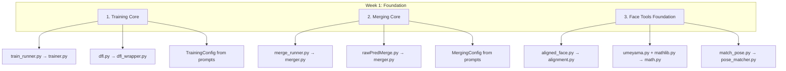

### ⚡ Medium Priority (Week 2)

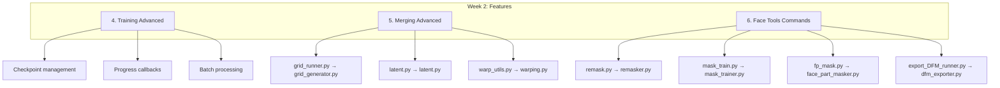

### 📝 Lower Priority (Week 3)

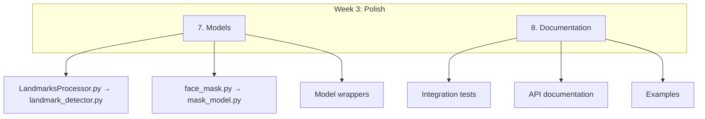

---

## 📈 Summary

### deepface-core

| Layer | Files | Estimated Lines |
|:------|------:|----------------:|
| CLI | 3 | 300 |
| Config | 3 | 500 |
| Core | 3 | 800 |
| Models | 2 | 200 |
| Pipelines | 2 | 300 |
| Utils | 8 | 1,200 |
| Tests | 3 | 600 |
| **Total** | **24** | **3,900** |

### face-processing-toolkit

| Layer | Files | Estimated Lines |
|:------|------:|----------------:|
| CLI | 6 | 400 |
| Config | 6 | 400 |
| Core | 5 | 900 |
| Models | 4 | 600 |
| Data | 2 | 400 |
| Pipelines | 5 | 400 |
| Utils | 5 | 800 |
| Tests | 5 | 600 |
| **Total** | **38** | **4,500** |

### Overall

| Metric | Value |
|:-------|------:|
| Total new files | ~62 |
| Total new lines | ~8,400 |
| Prompts eliminated | ~2,200 lines |
| Core logic preserved | ~4,000 lines |

---

**[📖 Extraction Plan](./EXTRACTION_PLAN.md)** • **[🏗️ Architecture](./ARCHITECTURE_DIAGRAMS.md)** • **[📖 Quick Reference](./QUICK_REFERENCE.md)** • **[📋 Summary](./EXTRACTION_SUMMARY.md)**

