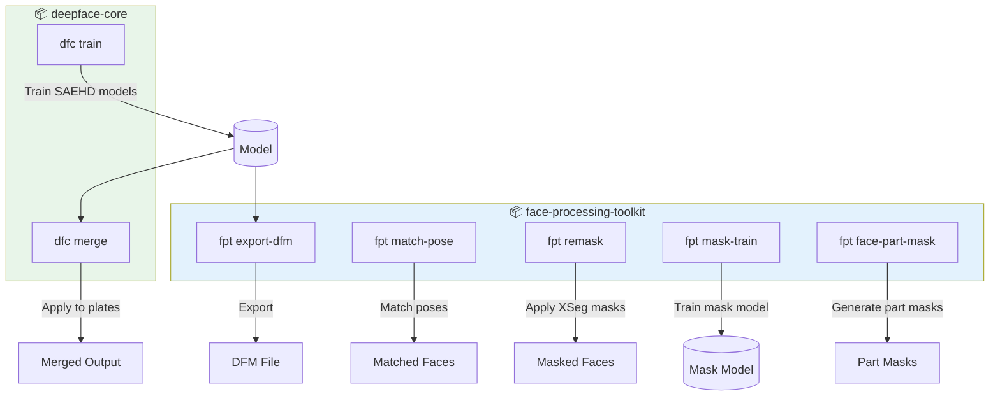

# 📖 Quick Reference

<div align="center">


**Quick reference for all commands, APIs, and configurations**

[Extraction Plan](./EXTRACTION_PLAN.md) • [Architecture](./ARCHITECTURE_DIAGRAMS.md) • [File Map](./FILE_EXTRACTION_MAP.md) • [Summary](./EXTRACTION_SUMMARY.md)

</div>

---

## 📋 Table of Contents

- [Commands Overview](#-commands-overview)
- [CLI Reference](#-cli-reference)
- [Python API](#-python-api)
- [Configuration Files](#-configuration-files)
- [Phase 2: Ivy Integration](#-phase-2-ivy-integration)
- [Troubleshooting](#-troubleshooting)

---

## 🎯 Commands Overview



| Package | Command | Description |
|:--------|:--------|:------------|
| `deepface-core` | `dfc train` | Train SAEHD face swap models |
| `deepface-core` | `dfc merge` | Merge trained model onto plates |
| `face-processing-toolkit` | `fpt match-pose` | Match source faces to destination poses |
| `face-processing-toolkit` | `fpt remask` | Apply XSeg masks to aligned faces |
| `face-processing-toolkit` | `fpt mask-train` | Train XSeg mask models |
| `face-processing-toolkit` | `fpt face-part-mask` | Generate face part masks |
| `face-processing-toolkit` | `fpt export-dfm` | Export model to DFM format |

---

## 💻 CLI Reference

### `dfc train`

> Train SAEHD face swap models

<details open>
<summary>📝 <b>Basic Usage</b></summary>

```bash
dfc train \
  --model my_model \
  --src /path/to/aligned_src \
  --dst /path/to/aligned_dst \
  --output /path/to/output
```

</details>

<details>
<summary>⚙️ <b>Full Options</b></summary>

```bash
dfc train \
  --model character_swap \
  --src /data/src_faces \
  --dst /data/dst_faces \
  --output /models/output \
  --resolution 256 \
  --batch-size 4 \
  --architecture LIAE_UDT \
  --encoder-dims 64 \
  --inter-dims 256 \
  --decoder-dims 64 \
  --mask-dims 22 \
  --learning-rate 6e-6 \
  --optimizer adam \
  --uniform-yaw \
  --random-warp \
  --checkpoint-interval 4
```

</details>

<details>
<summary>📄 <b>From Config File</b></summary>

```bash
dfc train --config /path/to/training_config.yaml
```

</details>

<details>
<summary>🔄 <b>Resume Training</b></summary>

```bash
dfc train \
  --model-path /path/to/existing_model \
  --output /path/to/output
```

</details>

---

### `dfc merge`

> Merge trained model onto plate images

<details open>
<summary>📝 <b>Basic Usage</b></summary>

```bash
dfc merge \
  --model /path/to/model \
  --plates /path/to/plates \
  --aligned /path/to/aligned \
  --output /path/to/output
```

</details>

<details>
<summary>⚙️ <b>Full Options</b></summary>

```bash
dfc merge \
  --model /models/my_model \
  --plates /shots/shot_010/plates \
  --aligned /shots/shot_010/aligned \
  --output /output/merged \
  --mode raw_rgb \
  --merge-on-alignments \
  --latent-shift /path/to/latent.npy \
  --latent-scale 1.0 \
  --enable-warp \
  --warp-matches 3 \
  --generate-grid \
  --generate-yaw-grid \
  --generate-mask-grid \
  --generate-mp4 \
  --mp4-quality high \
  --batch-size 16 \
  --interpolator lanczos4
```

</details>

**Merge Modes:**

| Mode | Description |
|:-----|:------------|
| `raw_rgb` | Raw RGB output |
| `raw_pred` | Raw prediction output |
| `raw_rgb+pred` | Both RGB and prediction |
| `seamless` | Seamless blending |

---

### `fpt match-pose`

> Match source faces to destination poses

```bash
fpt match-pose \
  --src /path/to/src_aligned \
  --dst /path/to/dst_aligned \
  --output /path/to/matched \
  --threshold 0.8 \
  --max-matches 10 \
  --use-3d-landmarks
```

---

### `fpt remask`

> Apply XSeg masks to aligned faces

```bash
fpt remask \
  --input /path/to/aligned \
  --checkpoint /path/to/mask.pt \
  --features face,nose,mouth \
  --batch-size 16
```

**Available Features:**

| Feature | Description |
|:--------|:------------|
| `face` | Full face mask |
| `eyes` | Eyes region |
| `iris` | Iris only |
| `eyebrow` | Eyebrows |
| `nose` | Nose region |
| `lip` | Lips |
| `mouth` | Full mouth |
| `ear` | Ears |
| `hair` | Hair region |

---

### `fpt mask-train`

> Train XSeg mask models

```bash
fpt mask-train \
  --data /path/to/training_data \
  --output /path/to/model_output \
  --epochs 100 \
  --batch-size 8 \
  --learning-rate 1e-4 \
  --resolution 512
```

---

### `fpt face-part-mask`

> Generate face part masks

```bash
fpt face-part-mask \
  --input /path/to/aligned \
  --features face,eyes,mouth \
  --mask-type both \
  --plates /path/to/plates \
  --checkpoint /path/to/checkpoint.pt
```

**Mask Types:**

| Type | Description |
|:-----|:------------|
| `aligned` | Masks for aligned faces only |
| `plate` | Masks for plate images only |
| `both` | Both aligned and plate masks |

---

### `fpt export-dfm`

> Export model to DFM format

```bash
fpt export-dfm \
  --model /path/to/model \
  --output /path/to/output.dfm \
  --latent-support
```

---

## 🐍 Python API

### Training Pipeline

<details open>
<summary>📝 <b>Basic Training</b></summary>

```python
from deepface_core import TrainingConfig, TrainingPipeline
from pathlib import Path

config = TrainingConfig(
    model_name="my_model",
    src_dataset=Path("/data/src"),
    dst_dataset=Path("/data/dst"),
    output_dir=Path("/output"),
    resolution=128,
    batch_size=8,
)

pipeline = TrainingPipeline(config)
pipeline.train()
```

</details>

<details>
<summary>⚙️ <b>Advanced Training</b></summary>

```python
from deepface_core import TrainingConfig, TrainingPipeline
from deepface_core.config import (
    ModelArchitecture,
    BorderMode,
    Optimizer,
    FreezeMode,
)
from pathlib import Path

config = TrainingConfig(
    # ═══════════════════════════════════════
    # Basic
    # ═══════════════════════════════════════
    model_name="character_swap",
    src_dataset=Path("/data/character_a"),
    dst_dataset=Path("/data/character_b"),
    output_dir=Path("/models/output"),
    
    # ═══════════════════════════════════════
    # Architecture
    # ═══════════════════════════════════════
    model_architecture=ModelArchitecture.LIAE_UDT,
    resolution=256,
    encoder_dims=64,
    inter_dims=256,
    decoder_dims=64,
    mask_dims=22,
    
    # ═══════════════════════════════════════
    # Training
    # ═══════════════════════════════════════
    batch_size=4,
    learning_rate=6e-6,
    optimizer=Optimizer.ADAM,
    
    # ═══════════════════════════════════════
    # Loss Weights
    # ═══════════════════════════════════════
    loss_weight_dssim=10.0,
    loss_weight_lpips=0.5,
    
    # ═══════════════════════════════════════
    # Augmentation
    # ═══════════════════════════════════════
    uniform_yaw=True,
    random_warp=True,
    random_blur=True,
    
    # ═══════════════════════════════════════
    # Checkpoints
    # ═══════════════════════════════════════
    checkpoint_interval_hours=4,
    checkpoint_count=4,
)

pipeline = TrainingPipeline(config)
pipeline.train()
```

</details>

---

### Merging Pipeline

<details open>
<summary>📝 <b>Basic Merging</b></summary>

```python
from deepface_core import MergingConfig, MergingPipeline
from pathlib import Path

config = MergingConfig(
    model_path=Path("/models/my_model"),
    plates_dir=Path("/shots/shot_010/plates"),
    aligned_dir=Path("/shots/shot_010/aligned"),
    output_dir=Path("/output/merged"),
)

pipeline = MergingPipeline(config)
pipeline.merge()
```

</details>

<details>
<summary>⚙️ <b>Advanced Merging</b></summary>

```python
from deepface_core import MergingConfig, MergingPipeline
from deepface_core.config import MergeMode, Interpolator
from pathlib import Path

config = MergingConfig(
    model_path=Path("/models/my_model"),
    plates_dir=Path("/shots/shot_010/plates"),
    aligned_dir=Path("/shots/shot_010/aligned"),
    output_dir=Path("/output/merged"),
    
    # Mode
    merge_mode=MergeMode.RAW_RGB,
    merge_on_alignments=True,
    
    # Latent
    latent_shift_file=Path("/latent/shift.npy"),
    latent_shift_scale=1.0,
    
    # Warping
    enable_warp=True,
    n_matches_to_warp=3,
    
    # Grid
    generate_grid=True,
    generate_yaw_grid=True,
    generate_mask_grid=True,
    
    # Output
    generate_mp4=True,
    mp4_quality="high",
    interpolator=Interpolator.LANCZOS4,
)

pipeline = MergingPipeline(config)
pipeline.merge()
```

</details>

---

### Face Processing Pipelines

<details>
<summary>🎯 <b>Pose Matching</b></summary>

```python
from face_processing_toolkit import PoseMatchingConfig, PoseMatchingPipeline
from pathlib import Path

config = PoseMatchingConfig(
    src_dir=Path("/src_faces"),
    dst_dir=Path("/dst_faces"),
    output_dir=Path("/matched"),
    similarity_threshold=0.8,
    max_matches=10,
)

pipeline = PoseMatchingPipeline(config)
results = pipeline.match()
```

</details>

<details>
<summary>🎭 <b>Remasking</b></summary>

```python
from face_processing_toolkit import RemaskingConfig, RemaskingPipeline
from pathlib import Path

config = RemaskingConfig(
    input_dir=Path("/aligned"),
    checkpoint_path=Path("/checkpoints/mask.pt"),
    features=["face", "nose", "mouth"],
    batch_size=16,
)

pipeline = RemaskingPipeline(config)
pipeline.remask()
```

</details>

<details>
<summary>🧠 <b>Mask Training</b></summary>

```python
from face_processing_toolkit import MaskTrainingConfig, MaskTrainingPipeline
from pathlib import Path

config = MaskTrainingConfig(
    training_data_paths=[
        Path("/data/aligned_1/masks"),
        Path("/data/aligned_2/masks"),
    ],
    output_dir=Path("/models/xseg"),
    epochs=100,
    batch_size=8,
    learning_rate=1e-4,
)

pipeline = MaskTrainingPipeline(config)
pipeline.train()
```

</details>

---

## 📄 Configuration Files

### Training Config (YAML)

```yaml
# training_config.yaml

# ═══════════════════════════════════════════════════════════
# Basic Configuration
# ═══════════════════════════════════════════════════════════
model_name: character_swap
src_dataset: /data/src
dst_dataset: /data/dst
output_dir: /models/output

# ═══════════════════════════════════════════════════════════
# Architecture
# ═══════════════════════════════════════════════════════════
model_architecture: LIAE_UDT
resolution: 256
encoder_dims: 64
inter_dims: 256
decoder_dims: 64
mask_dims: 22

# ═══════════════════════════════════════════════════════════
# Training
# ═══════════════════════════════════════════════════════════
batch_size: 4
learning_rate: 0.000006
learning_rate_dropout: true

# ═══════════════════════════════════════════════════════════
# Optimizer
# ═══════════════════════════════════════════════════════════
optimizer: adam
optimizer_gradient_clip: true

# ═══════════════════════════════════════════════════════════
# Loss Weights
# ═══════════════════════════════════════════════════════════
loss_weight_dssim: 10.0
loss_weight_lpips: 0.5

# ═══════════════════════════════════════════════════════════
# Augmentation
# ═══════════════════════════════════════════════════════════
border_mode: replicate
uniform_yaw: true
random_warp: true

# ═══════════════════════════════════════════════════════════
# Checkpoints
# ═══════════════════════════════════════════════════════════
checkpoint_interval_hours: 4
checkpoint_count: 4
```

---

### Merging Config (YAML)

```yaml
# merging_config.yaml

# ═══════════════════════════════════════════════════════════
# Paths
# ═══════════════════════════════════════════════════════════
model_path: /models/my_model
plates_dir: /shots/shot_010/plates
aligned_dir: /shots/shot_010/aligned
output_dir: /output/merged

# ═══════════════════════════════════════════════════════════
# Mode
# ═══════════════════════════════════════════════════════════
merge_mode: raw_rgb
merge_on_alignments: true

# ═══════════════════════════════════════════════════════════
# Latent
# ═══════════════════════════════════════════════════════════
latent_shift_file: /latent/shift.npy
latent_shift_scale: 1.0

# ═══════════════════════════════════════════════════════════
# Warping
# ═══════════════════════════════════════════════════════════
enable_warp: true
n_matches_to_warp: 3

# ═══════════════════════════════════════════════════════════
# Output
# ═══════════════════════════════════════════════════════════
generate_grid: true
generate_mp4: true
mp4_quality: high
```

---

## 🔗 Phase 2: Ivy Integration

### CLI with Ivy

```bash
# Train with Ivy sources
dfc train \
  --src-stem "SHOW/shots/shot_010" \
  --dst-stem "SHOW/assets/person_b" \
  --publish \
  --kind "saehd"

# Merge with Ivy
dfc merge \
  --model-stem "SHOW/shots/shot_010" \
  --plates-stem "SHOW/shots/shot_010" \
  --publish \
  --kind "cgr"
```

### Python with Ivy

```python
from deepface_core import TrainingConfig, TrainingPipeline
from deepface_core.ivy import IvyAdapter, IvyPublisher
from pathlib import Path

# Initialize Ivy adapter
ivy = IvyAdapter(job="SHOWNAME")

# Query datasets from Ivy
src_paths = ivy.query_aligned_faces("shots/shot_010", "aligned_src")
dst_paths = ivy.query_aligned_faces("assets/person_b", "aligned_dst")

# Configure training
config = TrainingConfig(
    model_name="my_model",
    src_dataset=src_paths,
    dst_dataset=dst_paths,
    output_dir=Path("/local/output"),
)

# Train
pipeline = TrainingPipeline(config)
pipeline.train()

# Publish model to Ivy
publisher = IvyPublisher(job="SHOWNAME")
publisher.publish_model(
    model_path=config.output_dir,
    scope_stem="shots/shot_010",
    kind="saehd",
    dependencies=[src_paths, dst_paths],
)
```

---

## 🔧 Troubleshooting

### Dataset Not Found

```bash
# Verify paths exist
ls -la /path/to/dataset

# Check permissions
chmod -R 755 /path/to/dataset
```

### CUDA Out of Memory

> [!TIP]
> Reduce batch size or resolution to fit in GPU memory

```bash
# Reduce batch size
dfc train --batch-size 4

# Reduce resolution
dfc train --resolution 128
```

### GPU Batch Size Guide

| GPU | VRAM | Batch Size (256 res) | Batch Size (128 res) |
|:----|-----:|---------------------:|---------------------:|
| RTX 3090 | 24GB | 8-16 | 16-32 |
| RTX 4090 | 24GB | 8-16 | 16-32 |
| A100 | 40GB | 16-32 | 32-64 |


---

<div align="center">

**[📖 Extraction Plan](./EXTRACTION_PLAN.md)** • **[🏗️ Architecture](./ARCHITECTURE_DIAGRAMS.md)** • **[📁 File Map](./FILE_EXTRACTION_MAP.md)** • **[📋 Summary](./EXTRACTION_SUMMARY.md)**

</div>
